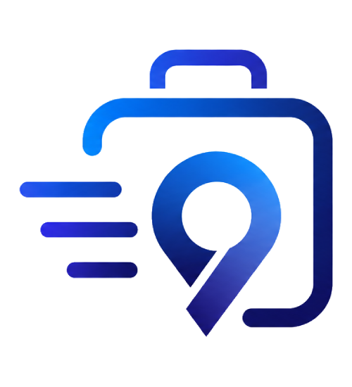

# 🧳 Bag Connect

<p align="center">
  
</p>

<p align="center">
  <strong>Conectando passageiros ao suporte de bagagens aeroportuárias.</strong>
</p>

---

## 📖 Sobre o Projeto

O **Bag Connect** é um aplicativo desenvolvido em **Python** utilizando o framework **Kivy**, criado como projeto final do curso de **Programador de Sistemas** do **Qualifica Maricá**.

O projeto nasceu de uma parceria entre as turmas dos cursos de **Programador de Sistemas** e **Agente de Aeroporto**, onde a turma de Agente de Aeroporto apresentou a necessidade de uma aplicação para complementar a apresentação de seu projeto final.

Embora o requisito inicial fosse apenas um aplicativo de suporte ao cliente, o projeto foi expandido para simular uma aplicação profissional, incluindo autenticação de usuários, banco de dados, gerenciamento de telas e uma arquitetura organizada seguindo boas práticas de desenvolvimento.

---

# 🎯 Objetivos

O Bag Connect tem como objetivo oferecer um ambiente para:

- Login de usuários
- Cadastro de usuários
- Atendimento de suporte
- Consulta de bagagens
- Configurações do aplicativo
- Interface moderna
- Estrutura escalável para futuras funcionalidades

---

# 🚀 Tecnologias Utilizadas

- Python 3
- Kivy
- SQLite (Banco de Dados)
- Git
- GitHub

---

# 📁 Estrutura do Projeto

```
BagConnect/
│
├── app/
│   │
│   ├── assets/
│   │   ├── icons/
│   │   └── images/
│   │       ├── avatar_default.png
│   │       ├── banner_home.jpeg
│   │       └── logo.png
│   │
│   ├── core/
│   │   ├── app.py
│   │   ├── idioma.py
│   │   ├── manager.py
│   │   ├── session.py
│   │   └── theme.py
│   │
│   ├── data/
│   │   └── bagconnect.db
│   │
│   ├── kv/
│   │   ├── find_bags.kv
│   │   ├── home.kv
│   │   ├── login.kv
│   │   ├── profile.kv
│   │   └── register.kv
│   │
│   ├── models/
│   │   ├── bag.py
│   │   ├── passenger.py
│   │   └── user.py
│   │
│   ├── screens/
│   │   ├── find_bags.py
│   │   ├── home.py
│   │   ├── login.py
│   │   ├── profile.py
│   │   └── register.py
│   │
│   ├── services/
│   │   ├── auth_service.py
│   │   ├── bag_service.py
│   │   ├── database.py
│   │   └── user_service.py
│   │
│   ├── widgets/
│   │   ├── drawer.kv
│   │   └── drawer.py
│   │
│   └── main.py
│
├── .gitignore
├── README.md
└── requirements.txt
```

---

# 🏗️ Arquitetura

O projeto foi desenvolvido utilizando uma arquitetura modular, separando responsabilidades em diferentes camadas:

- **Core** → Inicialização do aplicativo e gerenciamento.
- **Screens** → Lógica das telas.
- **Kv** → Interface gráfica.
- **Models** → Modelos de dados.
- **Services** → Regras de negócio e acesso ao banco.
- **Widgets** → Componentes reutilizáveis.
- **Assets** → Imagens, ícones e recursos visuais.

Essa organização facilita a manutenção, escalabilidade e colaboração entre os membros da equipe.

---

# 📌 Funcionalidades

- [x] Sistema de Login
- [x] Cadastro de Usuário
- [x] Tela Inicial
- [x] Navegação por Telas
- [x] Tema Personalizado
- [x] Internacionalização (Idiomas)
- [x] Banco de Dados
- [x] Consulta de Bagagens
- [ ] Atendimento Online
- [ ] Recuperação de Senha
- [ ] Tradução

---

# ⚙️ Instalação

Clone o repositório:

```bash
git clone https://github.com/WevertonGameDev/BagConnect.git
```

Entre na pasta:

```bash
cd BagConnect
```

Instale as dependências:

```bash
pip install -r requirements.txt
```

Execute o projeto:

```bash
python app/main.py
```

---

# 👨‍💻 Equipe

Projeto desenvolvido pelos alunos do curso de **Programador de Sistemas** do **Qualifica Maricá**, em parceria com a turma de **Agente de Aeroporto**.

### Tech Lead
- Weverton Alves

### Frontend
- Miguel Ng
- João

### Backend
- Marcelo
- Felipe

---

# 📅 Roadmap

### Versão 1.0

- Estrutura inicial
- Navegação entre telas
- Sistema de Login
- Sistema de Cadastro

### Versão 2.0

- Banco de Dados
- Persistência de usuários
- Perfil do Usuário
- Melhorias visuais

### Versão 3.0

- Consulta de bagagens
- Sistema de suporte
- Configurações
- Internacionalização

---

# 📜 Licença

Este projeto foi desenvolvido para fins educacionais como projeto final do curso **Programador de Sistemas** do **Qualifica Maricá**.
